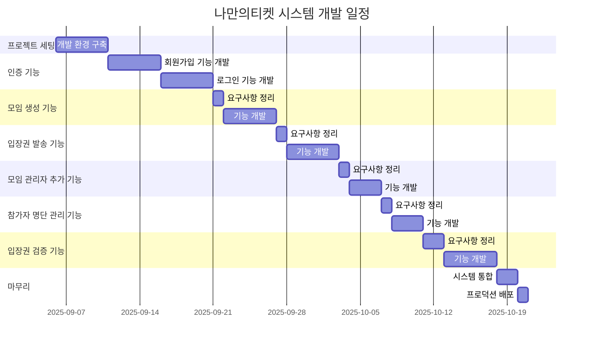

# Gantt Chart

```mermaid
gantt
  title 나만의티켓 시스템 개발 일정
  dateFormat  YYYY-MM-DD
  axisFormat  %Y-%m-%d

  section 프로젝트 세팅
    개발 환경 구축            :a1, 2025-09-06, 5d

  section 인증 기능
    회원가입 기능 개발        :b1, after a1, 5d
    로그인 기능 개발          :b2, after b1, 5d

  section 모임 생성 기능
    요구사항 정리             :c1, after b2, 1d
    기능 개발                 :c2, after c1, 5d

  section 입장권 발송 기능
    요구사항 정리             :d1, after c2, 1d
    기능 개발                 :d2, after d1, 5d

  section 모임 관리자 추가 기능
    요구사항 정리             :e1, after d2, 1d
    기능 개발                 :e2, after e1, 3d

  section 참가자 명단 관리 기능
    요구사항 정리             :f1, after e2, 1d
    기능 개발                 :f2, after f1, 3d

  section 입장권 검증 기능
    요구사항 정리             :g1, after f2, 2d
    기능 개발                 :g2, after g1, 5d

  section 마무리
    시스템 통합             :h1, after g2, 2d
    프로덕션 배포            :h2, after h1, 1d
```
