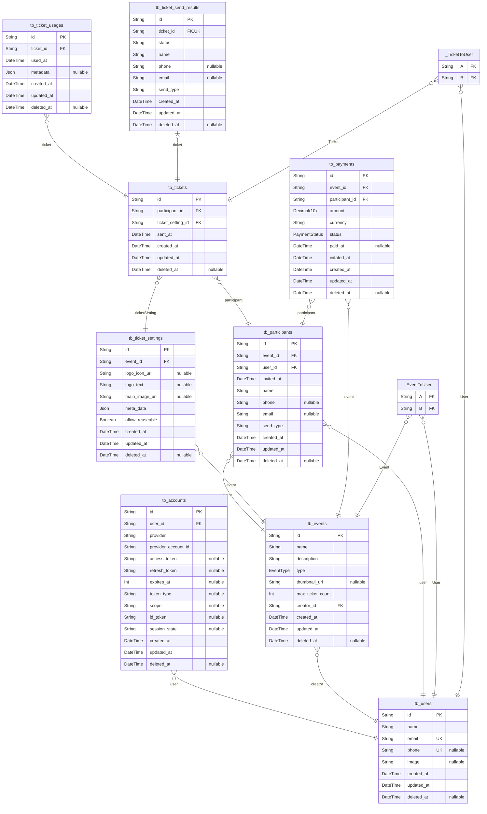

# My Ticket

> Generated by [`prisma-markdown`](https://github.com/samchon/prisma-markdown)

- [default](#default)

## default

### `tb_users`

**Properties**

- `id`:
- `name`:
- `email`:
- `phone`:
- `image`:
- `created_at`:
- `updated_at`:
- `deleted_at`:

### `tb_accounts`

**Properties**

- `id`:
- `user_id`:
- `provider`:
- `provider_account_id`:
- `access_token`:
- `refresh_token`:
- `expires_at`:
- `token_type`:
- `scope`:
- `id_token`:
- `session_state`:
- `created_at`:
- `updated_at`:
- `deleted_at`:

### `tb_events`

**Properties**

- `id`:
- `name`:
- `description`:
- `type`:
- `thumbnail_url`:
- `max_ticket_count`:
- `creator_id`:
- `created_at`:
- `updated_at`:
- `deleted_at`:

### `tb_participants`

**Properties**

- `id`:
- `event_id`:
- `user_id`:
- `invited_at`:
- `name`:
- `phone`:
- `email`:
- `send_type`:
- `created_at`:
- `updated_at`:
- `deleted_at`:

### `tb_ticket_settings`

**Properties**

- `id`:
- `event_id`:
- `logo_icon_url`:
- `logo_text`:
- `main_image_url`:
- `meta_data`:
- `allow_reuseable`:
- `created_at`:
- `updated_at`:
- `deleted_at`:

### `tb_tickets`

**Properties**

- `id`:
- `participant_id`:
- `ticket_setting_id`:
- `sent_at`:
- `created_at`:
- `updated_at`:
- `deleted_at`:

### `tb_ticket_usages`

**Properties**

- `id`:
- `ticket_id`:
- `used_at`:
- `metadata`:
- `created_at`:
- `updated_at`:
- `deleted_at`:

### `tb_ticket_send_results`

**Properties**

- `id`:
- `ticket_id`:
- `status`:
- `name`:
- `phone`:
- `email`:
- `send_type`:
- `created_at`:
- `updated_at`:
- `deleted_at`:

### `tb_payments`

**Properties**

- `id`:
- `event_id`:
- `participant_id`:
- `amount`:
- `currency`:
- `status`:
- `paid_at`:
- `initated_at`:
- `created_at`:
- `updated_at`:
- `deleted_at`:

### `_EventToUser`

Pair relationship table between [tb_events](#tb_events) and [tb_users](#tb_users)

**Properties**

- `A`:
- `B`:

### `_TicketToUser`

Pair relationship table between [tb_tickets](#tb_tickets) and [tb_users](#tb_users)

**Properties**

- `A`:
- `B`:
